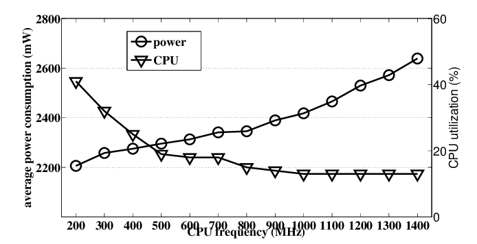

# Homework 1
### Create cloud simulators in Scala for evaluating executions of applications in cloud datacenters with different characteristics and deployment models.
### Grade: 8%

## Author
Andrea Cappelletti  
UIN: 674197701   
acappe2@uic.edu  


## 1) TimeShared vs SpaceShared policies
This very first basic simulation is run in order to understand the concepts
of TimeShared and SpaceShared policies. 

In general when we want to run some cloudlets we have to assign some kind of
priority for the computation. 

Asking questions like 

Is it more important that I get the overall result faster or is it more important
that some Cloudlets end the computation before others ?

Questions like this will lead our choices when it comes to standard
policies, indeed if we choose to use a TimeShared policy we can
notice that the overall execution time will be less with respect to the overall
execution time of the simulation running with a SpaceShared policy.

On the other side of the medal, we can also notice that with a TimeShared policy
the individual Cloudlet takes longer to execute, meanwhile using a SpaceShared policy
will reduce the individual execution time of a Cloudlet.


Let's consider the following architecture


### Five stage pipeline


## 2) Cost computation
Let's suppose we are a broker, and we have to sell computing time 
trying to minimize the cost in order to make more money. 

At first, we should define some costs for our resource usage, in order to do that
we have to consider the cost of the CPU per second, the cost of the Ram per MB,
the cost of the Bandwidth allocated per MB and finally the cost of the Storage
per MB.   

This simulation provides a cost estimation of running a large cloud provider.

The following simulations aims to implement some policies to minimise this cost.

This simulation adopts a dynamical algorithm to generate Cloudlets.
In order to write the algorithm I extended a Java class that implements two distribution

- Poisson distribution to generate the arrival time of a Cloudlet
- Gaussian distribution to define the Cloudlet parameters (PEs, length, size)


## 3) Power consumption
In order to have a complete overview of the costs for running our cloud environment
an important metric to consider is the power consumption.

### Efficiency
A very useful metrics when it comes to track performances is Efficiency.
In our specific case, Efficiency can be defined as
```
Efficiency = Power consumption / Output
```
Where the output can be seen as the total time taken in order to complete all
the Cloudlets assigned to our cloud environment.


### Possible Research Topic
An interesting idea would be considering the CPU usage and its power consumption and 
heat dissipation.

Can we say that running a CPU at 100% is better than running 10 CPUs at 20% ?

Maybe running a CPU at 100% will result in 70% effective power and 30% power dissipation, while
running several CPUs at 20% will result in 95% effective power and 5% power dissipation.

This comes down to efficiency.


  

Source: https://www.researchgate.net/figure/CPU-utilization-vs-power-draw_fig3_267394699

As we can notice from the chart above, the CPU power consumption will increase
with the CPU utilization and on the other hand it results more efficient
when the CPU utilization is low. 

In this scenario, there are more than one player. Indeed, we have to find the right
amount of computational units, the right % of utilization in order to have a more efficient
computation with respect of running only one unit at 100%.

This comes down to a trade-off between time and cost. 

We want our system to respond in a reasonable time, in the meanwhile we want to 
save money while performing the computation.

Both CPU usage and power consumption costs depend on time.

If we want to define an efficiency metrics for this context it has to include those 
two terms. 

A good efficiency metric can be trying to minimize
```
α(Execution Time) + Total Cost
```
Where α is a coefficient that represents a weight.
In order to find the right weight for this efficiency metric we can think
about this question

How much is the value of a second in your life ?

Let's suppose that a second of your life has price 1$ and let's consider the following scenario.

You have to take a train.

Which one do you prefer?

Train that will take you to the destination in 10 seconds 
Price: 500 $

Train that will take you to the destination in 500 seconds
Price: 10 $

In both cases you will pay 510$.

But you decide how much a value of a second in your life is up to, you do it
by setting that α.

# SaaS
Software as a Service
## 4) Data locality
When it comes to reducing latency we have to take into account the data locality,
more specifically where is the distributed computation performed and how much time
does it take to get the results in my current locality?

Let's consider the following architecture


In order to simulate this scenario the classes Cloudlet and Broker have been
extended. 

In the Cloudlet class I have added a field that set the locality
in which the Cloudlet will be executed. 

The broker knows the datacenters locality
and is able to assign the task to each datacenter in order to reduce the latency and
as a consequence the overall computation time and cost.

To write this simulation three different locality have been considered
- United States
- Italy
- Japan

Let's supposed I'm in the United States and I'm making an API call to retrieve
some data after this data has been processed. 
Unfortunately, the broker has not an optimised policy to handle this type of requests
and assign to my Cloudlets a datacenter in Japan.

I will experience a very high latency, moreover the costs for the broker will be
very high because of the inefficient total execution time.

## 5) Dynamically allocation


## 6) Network topology


Source: https://github.com/nsol-nmsu/brite-patch

## 7) Contribution
While I was getting familiar with the CloudSimPlus framework, running the examples provided by the official repo,
I noticed that there was a bug in the example   

*CostsExample1.java*    

Under ` /cloudsim-plus-examples/src/main/java/org/cloudsimplus/examples/costs/ `

The output of this simulation was
```
WARN  17946.90: VmAllocationPolicySimple: No suitable host found for Vm 4 in Datacenter 1
WARN  17946.90: VmAllocationPolicySimple: No suitable host found for Vm 5 in Datacenter 1
ERROR 17947.00: DatacenterBrokerSimple2: 2 of the requested 6 VMs couldn't be created because suitable Hosts weren't found in any available Datacenter.
INFO  17952.00: DatacenterBrokerSimple2: Trying to create Vm 4 in DatacenterSimple1
INFO  17952.00: DatacenterBrokerSimple2: Trying to create Vm 5 in DatacenterSimple1
```

The reason is that there were 6 VMs but enough resources only to allocate 4 of them.
The idea behind the example is that 2 VMs should be idle.

I decided to contribute to the project and open a pull request to fix this bug with the author of the CloudSimPlus framework.


The author recognized the bug, he accepted my pull request.  
We fixed it.


Now the simulation of the example can be executed and the output is the following
```
                                         SIMULATION RESULTS

|Cloudlet|Status |DC|Host|Host PEs |VM|VM PEs   |CloudletLen|CloudletPEs|StartTime|FinishTime|ExecTime
|--------|-------|--|----|---------|--|---------|-----------|-----------|---------|----------|--------
|      ID|       |ID|  ID|CPU cores|ID|CPU cores|         MI|  CPU cores|  Seconds|   Seconds| Seconds
|       0|SUCCESS| 1|   0|        8| 0|        4|     100000|          2|        0|       200|     200
|       1|SUCCESS| 1|   0|        8| 0|        4|     200000|          2|        0|       400|     400
|       2|SUCCESS| 1|   1|        8| 1|        4|     300000|          2|        0|       600|     600
|       3|SUCCESS| 1|   1|        8| 1|        4|     400000|          2|        0|       800|     800

Vm 0 costs ($) for   401.32 execution seconds - CPU:    16.05$ RAM:    10.24$ Storage:    10.00$ BW:     5.00$ Total:    41.29$
Vm 1 costs ($) for   800.32 execution seconds - CPU:    32.01$ RAM:    10.24$ Storage:    10.00$ BW:     5.00$ Total:    57.25$
Vm 2 costs ($) for     1.10 execution seconds - CPU:     0.04$ RAM:    10.24$ Storage:    10.00$ BW:     5.00$ Total:    25.28$
Vm 3 costs ($) for     1.10 execution seconds - CPU:     0.04$ RAM:    10.24$ Storage:    10.00$ BW:     5.00$ Total:    25.28$
Total cost ($) for   4 created VMs from   6 in DC 1:    48.15$         40.96$             40.00$        20.00$          149.11$
```
## Programming technology
All the simulations has been written in Scala using a Functional Programming approach.   

While writing the simulations the following best practices has been adopted

- Large usage of logging to understand the system status; 


- Configuration libraries and files to provide input values for the simulations; 


- No while or for loop is present, instead recursive functions are largely used into the project.

## Installation
There are mainly two ways to run them: through IntelliJ or via command line.

This section explains how to properly run them.      

In order to run the simulations on IntelliJ we have first to clone this repo
```
git clone https://github.com/andreacappelletti97/cloudsimplus_hw1.git
```

### IntelliJ

Then open IntelliJ IDE and select Open existing project  

Select the directory of the repo just cloned: cloudsimplus_hw1  

IntelliJ will import the entire project  

In order to run the simulations go to clousimplus_hw1/src/main/scala/Simulation

And press the green arrow near the main


### Command Line
In order to run the simulations from cli we need to use sbt  

First, go the file Simulation under /src/main/scala and uncomment
the simulation you want to run under the main invocation. 

For example if I want to run Simulation1 my Simulation file should look like

``` 
  @main def runSimulation =
    logger.info("Constructing a cloud model...")
    Simulation1.Start()
    logger.info("Finished cloud simulation...")
    //BasicCloudSimPlusExample.Start()
    //MyFirstExample.Start()
    //BasicFirstExample.start();
    //ReduceExample.Start()

```
Then run the following commands from the root directory of the project
```
sbt clean compile test
```
The output should be the following
``` 
[success] Total time: 15 s, completed 21 Sept 2021, 23:10:33
[info] compiling 1 Scala source to /Users/andreacappelletti/Downloads/UIC/Cloud Computing/HW 1/cloudsimplus_hw1/target/scala-3.0.2/test-classes ...
[info] BasicCloudSimPlusExampleTestSuite:
[info] configuration parameters module
[info] - should obtain the utilization ratio
[info] - should obtain the MIPS capacity
[info] Run completed in 771 milliseconds.
[info] Total number of tests run: 2
[info] Suites: completed 1, aborted 0
[info] Tests: succeeded 2, failed 0, canceled 0, ignored 0, pending 0
[info] All tests passed.
[success] Total time: 4 s, completed 21 Sept 2021, 23:10:37

```
And then
```
sbt clean compile run
```

## References
In order to produce the result obtained the following documents and paper
have been consulted.

- https://leanpub.com/edocc
- https://www.cs.bu.edu/fac/matta/Papers/mascots01-brite-user.pdf
- https://www.researchgate.net/figure/CPU-utilization-vs-power-draw_fig3_267394699
- https://ieeexplore.ieee.org/document/6123487
- https://acqnotes.com/Attachments/White%20Paper%20Introduction%20to%20Modeling%20and%20Simulation%20by%20Anu%20Maria.pdf
- http://www.cloudbus.org/cloudsim/
- https://github.com/manoelcampos/cloudsimplus/tree/master/cloudsim-plus-examples
- https://cloudsimplus.org/#example
- https://github.com/nsol-nmsu/brite-patch