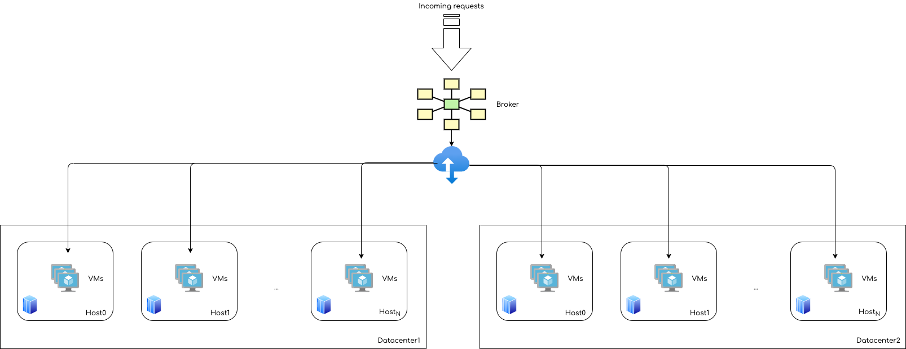

# Homework 1
### Create cloud simulators in Scala for evaluating executions of applications in cloud datacenters with different characteristics and deployment models.
### Grade: 8%

## Author
Andrea Cappelletti  
UIN: 674197701   
acappe2@uic.edu  


## 1) TimeShared vs SpaceShared policies
```
Simulation1
```
This very first basic simulation is run in order to understand the concepts
of TimeShared and SpaceShared policies. 

In general when we want to run some cloudlets we could assign some kind of
priority for the computation. 

Asking questions like 

Is it more important that I get the overall result faster or is it more important
that some Cloudlets end the computation before others ?

Questions like this will lead our choices when it comes to standard
policies, indeed if we choose to use a TimeShared policy we can
expect that the overall execution time will be less with respect to the overall
execution time of the simulation running with a SpaceShared policy.

On the other side of the medal, we can also think that with a TimeShared policy
the individual Cloudlet takes longer to execute, meanwhile using a SpaceShared policy
will reduce the individual execution time of a Cloudlet.

In this simulation we take in consideration this architecture



All the simulation configuration parameters can be found in the application.conf file under /resources.
We are looking at simulation1 and specifically we have
- Two datacenters: dc0 and dc1
- 3 Host distributed among the two datacenters
- 5 VMs per each Host
- 30 Cloudlets

Meanwhile, the SpaceShared policy is going to execute Cloudlets following a waiting queue (generally
FIFO: first in first out), the TimeShared policy implements parallel execution among instructions.

In order to understand how TimeShared works, we can take into account the classic risc pipeline.
It is composed by five stages, which are IF, ID, EX, MEM, WB.

If two Cloudlets end on the same VM, in a TimeShared policy, we have that the CPU try to run
the different instructions in paralles at the Operating System level implementing the context switching.

Let's suppose we have two Cloudlets on the same VM and 
that instruction 1 of the 1st Cloudlet is in the MEM phase, in a classical SpaceShared approach the CPU
will wait until the instruction completes all the stages.  
Using a TimeShared policy, the CPU at the OS level can already start the ID phase 
of instruction 2 (which owner is the 2nd Cloudlet) 
and execute the two instruction with some kind of parallelism mechanism.

### Five stage pipeline


In the end, this brings us to the conclusion that if we want speed up the overall execution time of our Cloudlets
we should use a TimeShared policy, meanwhile if we want to speed up the single execution time of a Cloudlet we should
prefer a SpaceShared policy.

But, as we will see in this simulation, this conclusion really depends on the context.
Indeed if we run the simulation with a TimeShared policy we obtain the following result
```

                                         SIMULATION RESULTS

Cloudlet|Status |DC|Host|Host PEs |VM|VM PEs   |CloudletLen|CloudletPEs|StartTime|FinishTime|ExecTime
      ID|       |ID|  ID|CPU cores|ID|CPU cores|         MI|  CPU cores|  Seconds|   Seconds| Seconds
-----------------------------------------------------------------------------------------------------
       0|SUCCESS| 2|   0|        4| 0|        4|      20000|          4|        0|       101|     100
       5|SUCCESS| 2|   0|        4| 0|        4|      20000|          4|        0|       101|     100
      10|SUCCESS| 2|   0|        4| 0|        4|      20000|          4|        0|       101|     100
       1|SUCCESS| 3|   0|        4| 1|        4|      20000|          4|        0|       101|     100
       6|SUCCESS| 3|   0|        4| 1|        4|      20000|          4|        0|       101|     100
      11|SUCCESS| 3|   0|        4| 1|        4|      20000|          4|        0|       101|     100
       4|SUCCESS| 3|   0|        4| 4|        4|      20000|          4|        0|       101|     100
       9|SUCCESS| 3|   0|        4| 4|        4|      20000|          4|        0|       101|     100
      14|SUCCESS| 3|   0|        4| 4|        4|      20000|          4|        0|       101|     100
       2|SUCCESS| 3|   1|        4| 2|        4|      20000|          4|        0|       101|     100
       7|SUCCESS| 3|   1|        4| 2|        4|      20000|          4|        0|       101|     100
      12|SUCCESS| 3|   1|        4| 2|        4|      20000|          4|        0|       101|     100
       3|SUCCESS| 3|   1|        4| 3|        4|      20000|          4|        0|       101|     100
       8|SUCCESS| 3|   1|        4| 3|        4|      20000|          4|        0|       101|     100
      13|SUCCESS| 3|   1|        4| 3|        4|      20000|          4|        0|       101|     100
      15|SUCCESS| 2|   0|        4| 0|        4|      20000|          4|        0|       152|     151
      20|SUCCESS| 2|   0|        4| 0|        4|      20000|          4|        0|       152|     151
      25|SUCCESS| 2|   0|        4| 0|        4|      20000|          4|        0|       152|     151
      16|SUCCESS| 3|   0|        4| 1|        4|      20000|          4|        0|       152|     151
      21|SUCCESS| 3|   0|        4| 1|        4|      20000|          4|        0|       152|     151
      26|SUCCESS| 3|   0|        4| 1|        4|      20000|          4|        0|       152|     151
      19|SUCCESS| 3|   0|        4| 4|        4|      20000|          4|        0|       152|     151
      24|SUCCESS| 3|   0|        4| 4|        4|      20000|          4|        0|       152|     151
      29|SUCCESS| 3|   0|        4| 4|        4|      20000|          4|        0|       152|     151
      17|SUCCESS| 3|   1|        4| 2|        4|      20000|          4|        0|       152|     151
      22|SUCCESS| 3|   1|        4| 2|        4|      20000|          4|        0|       152|     151
      27|SUCCESS| 3|   1|        4| 2|        4|      20000|          4|        0|       152|     151
      18|SUCCESS| 3|   1|        4| 3|        4|      20000|          4|        0|       152|     151
      23|SUCCESS| 3|   1|        4| 3|        4|      20000|          4|        0|       152|     151
      28|SUCCESS| 3|   1|        4| 3|        4|      20000|          4|        0|       152|     151
-----------------------------------------------------------------------------------------------------
```

We obtained an overall execution time of 152 seconds.
As we can notice the first tasks execute in 101 seconds and the last ones in 152 seconds.

Now if we run the same simulation with SpaceShared we can expect
to obtain an overall time greater than 152 seconds but the single cloudlet execution time of the first
in the queue more efficient than 101 seconds.

```
                                         SIMULATION RESULTS

Cloudlet|Status |DC|Host|Host PEs |VM|VM PEs   |CloudletLen|CloudletPEs|StartTime|FinishTime|ExecTime
      ID|       |ID|  ID|CPU cores|ID|CPU cores|         MI|  CPU cores|  Seconds|   Seconds| Seconds
-----------------------------------------------------------------------------------------------------
       0|SUCCESS| 2|   0|        4| 0|        4|      20000|          4|        0|        17|      17
       1|SUCCESS| 3|   0|        4| 1|        4|      20000|          4|        0|        17|      17
       4|SUCCESS| 3|   0|        4| 4|        4|      20000|          4|        0|        17|      17
       2|SUCCESS| 3|   1|        4| 2|        4|      20000|          4|        0|        17|      17
       3|SUCCESS| 3|   1|        4| 3|        4|      20000|          4|        0|        17|      17
       5|SUCCESS| 2|   0|        4| 0|        4|      20000|          4|       17|        34|      17
       6|SUCCESS| 3|   0|        4| 1|        4|      20000|          4|       17|        34|      17
       9|SUCCESS| 3|   0|        4| 4|        4|      20000|          4|       17|        34|      17
       7|SUCCESS| 3|   1|        4| 2|        4|      20000|          4|       17|        34|      17
       8|SUCCESS| 3|   1|        4| 3|        4|      20000|          4|       17|        34|      17
      10|SUCCESS| 2|   0|        4| 0|        4|      20000|          4|       34|        50|      17
      11|SUCCESS| 3|   0|        4| 1|        4|      20000|          4|       34|        50|      17
      14|SUCCESS| 3|   0|        4| 4|        4|      20000|          4|       34|        50|      17
      12|SUCCESS| 3|   1|        4| 2|        4|      20000|          4|       34|        50|      17
      13|SUCCESS| 3|   1|        4| 3|        4|      20000|          4|       34|        50|      17
      15|SUCCESS| 2|   0|        4| 0|        4|      20000|          4|       51|        67|      17
      16|SUCCESS| 3|   0|        4| 1|        4|      20000|          4|       51|        67|      17
      19|SUCCESS| 3|   0|        4| 4|        4|      20000|          4|       51|        67|      17
      17|SUCCESS| 3|   1|        4| 2|        4|      20000|          4|       51|        67|      17
      18|SUCCESS| 3|   1|        4| 3|        4|      20000|          4|       51|        67|      17
      20|SUCCESS| 2|   0|        4| 0|        4|      20000|          4|       68|        84|      17
      21|SUCCESS| 3|   0|        4| 1|        4|      20000|          4|       68|        84|      17
      24|SUCCESS| 3|   0|        4| 4|        4|      20000|          4|       68|        84|      17
      22|SUCCESS| 3|   1|        4| 2|        4|      20000|          4|       68|        84|      17
      23|SUCCESS| 3|   1|        4| 3|        4|      20000|          4|       68|        84|      17
      25|SUCCESS| 2|   0|        4| 0|        4|      20000|          4|       85|       101|      17
      26|SUCCESS| 3|   0|        4| 1|        4|      20000|          4|       85|       101|      17
      29|SUCCESS| 3|   0|        4| 4|        4|      20000|          4|       85|       101|      17
      27|SUCCESS| 3|   1|        4| 2|        4|      20000|          4|       85|       101|      17
      28|SUCCESS| 3|   1|        4| 3|        4|      20000|          4|       85|       101|      17
-----------------------------------------------------------------------------------------------------
```

This is not the case, indeed we obtain a total execution time of 101 seconds , which outperforms
the TimeShared policy execution time. The single Cloudlet execution time outperforms the TimeShared approach
as well, indeed we have 17 seconds for the very first Cloudlets versus 101 seconds of the TimeShared policy.

It's a matter of resources, indeed in the TimeShared policy there are not enough
resources to execute the Cloudlets on the same VMs and the computation enter into a starvation mode.

In this case the SpaceShared policy outperforms the TimeShared policy, especially in terms of cost.

## 2) Cost computation
```
Simulation2
```
This simulation adopts a dynamical algorithm to generate Cloudlets.

To run the simulation we have first to set a simulation time from the application.conf file
``` 
simulationTime = 100 #in seconds
```

In order to write the algorithm I created a Java class called DynamicCloudletGenerator 
that can be found in /src/main/java/Extensions.  
The reason behind that class is that I did not find a suitable way to handle Event Listeners from Scala
to Java and viceversa. 

Indeed, converting parameters from the broker will result in
```
Java does not distinguish between mutable and immutable collections in their type,
a conversion from, say, scala.immutable.List will yield a java.util.List,
where all mutation operations throw an “UnsupportedOperationException”.
```
Source: https://docs.scala-lang.org/overviews/collections/conversions-between-java-and-scala-collections.html

This class implements two distribution:

- Poisson's distribution to generate the arrival time of a Cloudlet
- Gaussian distribution to define the Cloudlet parameters (PEs, length, size)

The Poisson distribution is the ideal distribution to set the Cloudlets submission delay.
In order to properly configure this distribution to generate random variables we have to choose the right mean.

Let's consider this chart


Source: https://en.wikipedia.org/wiki/Poisson_distribution

After looking at the distribution I would say that a proper value for the mean is 0.6 in order to generate
submissionDelays and not exceed the simulation time. 

Moreover, this mean allows also to not overlap in time:
it could not happend that a Cloudlet that has been generated at t1 is executed before than a Cloudlet generated
at t0 where t1>t0.

The gaussian random variable is generated following the distribution and taking as a mean
half of the maximum parameter value (suppose we want to generate Cloudlets with 1000 Mips, the mean would be 500)
and as a standard deviation 1/8 of the maximum parameter value.

This grant that the interval in which we generate the random gaussian variable is fixed and we do not
exceed the maximum value we want to have.

Let's suppose we are a broker, and we have to sell computing time 
trying to minimize the cost in order to make more money. 

At first, we should define some costs for our resource usage, in order to do that
we have to consider the cost of the CPU per second, the cost of the Ram per MB,
the cost of the Bandwidth allocated per MB and finally the cost of the Storage
per MB.   

This simulation provides a cost estimation of running a large cloud provider.
```
                                        SIMULATION RESULTS

Cloudlet|Status |DC|Host|Host PEs |VM|VM PEs   |CloudletLen|CloudletPEs|StartTime|FinishTime|ExecTime
      ID|       |ID|  ID|CPU cores|ID|CPU cores|         MI|  CPU cores|  Seconds|   Seconds| Seconds
-----------------------------------------------------------------------------------------------------
       0|SUCCESS| 2|   0|        1| 0|        1|        500|          1|        0|         7|       7
       1|SUCCESS| 2|   1|        1| 1|        1|        500|          1|        0|         7|       7
       2|SUCCESS| 2|   1|        1| 2|        1|        500|          1|        0|         7|       7
       3|SUCCESS| 2|   1|        1| 3|        1|        500|          1|        0|         7|       7
       4|SUCCESS| 2|   1|        1| 4|        1|        500|          2|        3|        23|      20
       5|SUCCESS| 2|   1|        1| 5|        1|        625|          2|        3|        29|      25
       6|SUCCESS| 2|   1|        1| 6|        1|        500|          2|       12|        32|      20
       7|SUCCESS| 2|   1|        1| 7|        1|        500|          2|       14|        34|      20
      26|SUCCESS| 2|   1|        1| 6|        1|        375|          2|       36|        55|      19
      18|SUCCESS| 2|   2|        1|18|        1|        375|          2|       34|        55|      22
-----------------------------------------------------------------------------------------------------
```

In this simulation I've learned that choosing the right allocation policy is very important when it comes
to provide resources. Because if your resource does not fit the demand you are not able to reply
to all the request, and when this happens you loose customers and money.
In the following simulations I'm going to derive my own policies to allocate resource and
reduce the latency time.

## 3) Power consumption
```
Simulation3
```
In order to have a complete overview of the costs for running our cloud environment
an important metric to consider is the power consumption, expecially when we are dealing 
with IaaS (Infrastructure as a Service).

Indeed, in a IaaS 

### Efficiency
A very useful metrics when it comes to track performances is Efficiency.
In our specific case, Efficiency can be defined as
```
Efficiency = Power consumption / Output
```
Where the output can be seen as the total time taken in order to complete all
the Cloudlets assigned to our cloud environment.


### Possible Research Topic
An interesting idea would be considering the CPU usage and its power consumption and 
heat dissipation.

Can we say that running a CPU at 100% is better than running 10 CPUs at 20% ?

Maybe running a CPU at 100% will result in 70% effective power and 30% power dissipation, while
running several CPUs at 20% will result in 95% effective power and 5% power dissipation.

This comes down to efficiency.


  

Source: https://www.researchgate.net/figure/CPU-utilization-vs-power-draw_fig3_267394699

As we can notice from the chart above, the CPU power consumption will increase
with the CPU utilization and on the other hand it results more efficient
when the CPU utilization is low. 

In this scenario, there are more than one player. Indeed, we have to find the right
amount of computational units, the right % of utilization in order to have a more efficient
computation with respect of running only one unit at 100%.

This comes down to a trade-off between time and cost. 

We want our system to respond in a reasonable time, in the meanwhile we want to 
save money while performing the computation.

Both CPU usage and power consumption costs depend on time.

If we want to define an efficiency metrics for this context it has to include those 
two terms. 

A good efficiency metric can be trying to minimize
```
α(Execution Time) + Total Cost
```
Where α is a coefficient that represents a weight.
In order to find the right weight for this efficiency metric we can think
about this question

How much is the value of a second in your life ?

Let's suppose that a second of your life has price 1$ and let's consider the following scenario.

You have to take a train.

Which one do you prefer?

Train that will take you to the destination in 10 seconds 
Price: 500 $

Train that will take you to the destination in 500 seconds
Price: 10 $

In both cases you will pay 510$.

But you decide how much a value of a second in your life is up to, you do it
by setting that α.


## 4) Data locality
```
Simulation4
```
When it comes to reducing latency we have to take into account the data locality,
more specifically where is the distributed computation performed and how much time
does it take to get the results in my current locality?

Let's consider the following architecture


In order to simulate this scenario the classes Cloudlet and Broker have been
extended and they can be found into the /src/main/java/Extensions directory.

In the ```CloudletExtension``` class I have added a field that set the locality
in which the Cloudlet will be executed. 

The broker, which is extended in the ```BrokerSimpleExtension``` class, knows the datacenters locality
and is able to assign the task to each datacenter in order to reduce the latency and
as a consequence the overall computation time thanks to the policy that I've implemented.

To write this simulation three different locality have been considered
- United States (location 1)
- Italy (location 2)
- Japan (location 3)

We have to set the locality of each datacenter in the application.conf file following this convention
```
dc0 {
locality = 1
...
```

Let's supposed I'm in the United States and I'm making an API call to retrieve
some data after this data has been processed. 
Unfortunately, the broker has not an optimised policy to handle this type of requests
and assign to my Cloudlets a datacenter in Japan following a Round Robin allocation policy.

I will experience a very high latency, and most of the time I don't want to wait to retrieve my data
(in case we are still considering an API call).

This is the result obtained from the simulation without the broker allocation policy based on the datacenter
locality.

``` 
                                         SIMULATION RESULTS

Cloudlet|Status |DC|Host|Host PEs |VM|VM PEs   |CloudletLen|CloudletPEs|StartTime|FinishTime|ExecTime
      ID|       |ID|  ID|CPU cores|ID|CPU cores|         MI|  CPU cores|  Seconds|   Seconds| Seconds
-----------------------------------------------------------------------------------------------------
       2|SUCCESS| 3|   0|        4| 2|        4|      20000|          4|        0|        17|      16
       3|SUCCESS| 3|   0|        4| 3|        4|      20000|          4|        0|        17|      16
       0|SUCCESS| 2|   0|        4| 0|        4|      20000|          4|      120|       137|      17
       1|SUCCESS| 2|   0|        4| 1|        4|      20000|          4|      120|       137|      17
       4|SUCCESS| 4|   0|        4| 4|        4|      20000|          4|      120|       137|      17
       5|SUCCESS| 4|   0|        4| 5|        4|      20000|          4|      120|       137|      17
-----------------------------------------------------------------------------------------------------
```

As we can see, for each Cloudlets that have been allocated into a different locality from the request origin,
there is a penalty in terms of latency to pay.
Indeed, the StartTime takes 120seconds (this penalty includes both forwarding and returning latency and
it is set as a submissionDelay just for implementation convenience).

To this penalty we have to sum the execution time of the Cloudlet.
The result is really inefficient.

Now let's look at the result of the simulation obtained with the broker policy of allocation that takes into
account the locality of the datacenter and the Cloudlet origin.

``` 
                                         SIMULATION RESULTS

Cloudlet|Status |DC|Host|Host PEs |VM|VM PEs   |CloudletLen|CloudletPEs|StartTime|FinishTime|ExecTime
      ID|       |ID|  ID|CPU cores|ID|CPU cores|         MI|  CPU cores|  Seconds|   Seconds| Seconds
-----------------------------------------------------------------------------------------------------
       4|SUCCESS| 2|   0|        4| 0|        4|      20000|          4|        0|        33|      33
       5|SUCCESS| 2|   0|        4| 0|        4|      20000|          4|        0|        33|      33
       2|SUCCESS| 3|   0|        4| 2|        4|      20000|          4|        0|        33|      33
       3|SUCCESS| 3|   0|        4| 2|        4|      20000|          4|        0|        33|      33
       0|SUCCESS| 4|   0|        4| 4|        4|      20000|          4|        0|        33|      33
       1|SUCCESS| 4|   0|        4| 4|        4|      20000|          4|        0|        33|      33
-----------------------------------------------------------------------------------------------------
```
The final result does not contain the delay given by the latency because all the Cloudlets are properly
allocated into the right location of the datacenter.

This allows us to minimise the response time, which could be very useful when it comes to SaaS as an
API calls requests.


## 5) Network topology
```
Simulation5
```

In this simulation I'm going to define my own network topology using Brite (Boston University Representative Internet Topology Generator).
The tool is available online on Github


Source: https://github.com/nsol-nmsu/brite-patch

The topology of the network is myNetwork.brite and can be found into the /src/resources directory. 

We have to set the topology for the simulation from the application.conf file following this convention
``` 
networkTopology = "myNetwork.brite"
```
First, we have to define the nodes of our network.
For this example I will consider 8 nodes.
For each node we have to specify the 

```Id, the X position, the Y position, the indegree and outdegree and finally the ASid type.
NodeId xpos ypos indegree outgdegree ASid type.
```
The result is this one
``` 
Nodes: ( 8 )
0	1	3	3	3	-1	RT_NODE
1	0	3	3	3	-1	RT_NODE
2	0	0	3	3	-1	RT_NODE
3	0	4	3	3	-1	RT_NODE
4	1	0	4	4	-1	RT_NODE
5	6	3	4	4	-1	RT_NODE
6	3	3	4	4	-1	RT_NODE
7	3	0	4	4	-1	RT_NODE
```
For each node we have to define the edges using the following format


Source: http://www.cs.columbia.edu/~abk2001/SIMPSON.html

My definition of edges is the following
``` 
Edges: ( 10 )
0	1	2	3.0			1.2	100.0	-1	-1	E_RT	U
1	2	4	1.0			0.7	100.0	-1	-1	E_RT	U
2	3	0	1.41421356237 3.9	100.0	-1	-1	E_RT	U
3	0	4	3.0        	4.1	100.0	-1	-1	E_RT	U
4	4	6	4.24264068712 9.7	100.0	-1	-1	E_RT	U
5	6	0	2.0			8.2	100.0	-1	-1	E_RT	U
6	5	3	6.0827625303 21.1	100.0	-1	-1	E_RT	U
7	7	6	3.0			5.0	100.0	-1	-1	E_RT	U
8   6	5	3.0			10.7	100.0	-1	-1	E_RT	U
9   5	7	4.24264068712 13.9	100.0	-1	-1	E_RT	U
```

The final result looks like


If we start a simulation and run the broker and the datacenter on the same node we obtain a not relevant
latency (very near to the 0).

``` 
                                         SIMULATION RESULTS

Cloudlet|Status |DC|Host|Host PEs |VM|VM PEs   |CloudletLen|CloudletPEs|StartTime|FinishTime|ExecTime
      ID|       |ID|  ID|CPU cores|ID|CPU cores|         MI|  CPU cores|  Seconds|   Seconds| Seconds
-----------------------------------------------------------------------------------------------------
       0|SUCCESS| 2|   0|        1| 0|        1|      40000|          1|        0|       320|     320
       1|SUCCESS| 2|   0|        1| 1|        1|      40000|          1|        0|       320|     320
       2|SUCCESS| 2|   0|        1| 0|        1|      40000|          1|        0|       480|     480
       3|SUCCESS| 2|   0|        1| 1|        1|      40000|          1|        0|       480|     480
-----------------------------------------------------------------------------------------------------
16:58:12.084 [main] INFO  java.lang.Class - Finished cloud simulation...
```

Now let's suppose we have a broker at node 5 and a datacenter at node 0, if we run the same Cloudlets
we are going to experience a delay in terms of latency.
The latency is given by the network topology and architecture.

``` 
================== Simulation finished at time 556.92 ==================


                                         SIMULATION RESULTS

Cloudlet|Status |DC|Host|Host PEs |VM|VM PEs   |CloudletLen|CloudletPEs|StartTime|FinishTime|ExecTime
      ID|       |ID|  ID|CPU cores|ID|CPU cores|         MI|  CPU cores|  Seconds|   Seconds| Seconds
-----------------------------------------------------------------------------------------------------
       0|SUCCESS| 2|   0|        1| 0|        1|      40000|          1|       57|       376|     319
       1|SUCCESS| 2|   0|        1| 1|        1|      40000|          1|       57|       376|     319
       2|SUCCESS| 2|   0|        1| 0|        1|      40000|          1|       57|       536|     479
       3|SUCCESS| 2|   0|        1| 1|        1|      40000|          1|       57|       536|     479
-----------------------------------------------------------------------------------------------------
```

As we can notice in this simulation the startTime of each Cloudlets is delayed by 57 seconds.


## 6) Contribution
While I was getting familiar with the CloudSimPlus framework, running the examples provided by the official repo,
I noticed that there was a bug in the example   

*CostsExample1.java*    

Under ` /cloudsim-plus-examples/src/main/java/org/cloudsimplus/examples/costs/ `

The output of this simulation was
```
WARN  17946.90: VmAllocationPolicySimple: No suitable host found for Vm 4 in Datacenter 1
WARN  17946.90: VmAllocationPolicySimple: No suitable host found for Vm 5 in Datacenter 1
ERROR 17947.00: DatacenterBrokerSimple2: 2 of the requested 6 VMs couldn't be created because suitable Hosts weren't found in any available Datacenter.
INFO  17952.00: DatacenterBrokerSimple2: Trying to create Vm 4 in DatacenterSimple1
INFO  17952.00: DatacenterBrokerSimple2: Trying to create Vm 5 in DatacenterSimple1
```

The reason is that there were 6 VMs but enough resources only to allocate 4 of them.
The idea behind the example is that 2 VMs should be idle.

I decided to contribute to the project and open a pull request to fix this bug with the author of the CloudSimPlus framework.


The author recognized the bug, he accepted my pull request.  
We fixed it.


Now the simulation of the example can be executed and the output is the following
```
                                         SIMULATION RESULTS

|Cloudlet|Status |DC|Host|Host PEs |VM|VM PEs   |CloudletLen|CloudletPEs|StartTime|FinishTime|ExecTime
|--------|-------|--|----|---------|--|---------|-----------|-----------|---------|----------|--------
|      ID|       |ID|  ID|CPU cores|ID|CPU cores|         MI|  CPU cores|  Seconds|   Seconds| Seconds
|       0|SUCCESS| 1|   0|        8| 0|        4|     100000|          2|        0|       200|     200
|       1|SUCCESS| 1|   0|        8| 0|        4|     200000|          2|        0|       400|     400
|       2|SUCCESS| 1|   1|        8| 1|        4|     300000|          2|        0|       600|     600
|       3|SUCCESS| 1|   1|        8| 1|        4|     400000|          2|        0|       800|     800

Vm 0 costs ($) for   401.32 execution seconds - CPU:    16.05$ RAM:    10.24$ Storage:    10.00$ BW:     5.00$ Total:    41.29$
Vm 1 costs ($) for   800.32 execution seconds - CPU:    32.01$ RAM:    10.24$ Storage:    10.00$ BW:     5.00$ Total:    57.25$
Vm 2 costs ($) for     1.10 execution seconds - CPU:     0.04$ RAM:    10.24$ Storage:    10.00$ BW:     5.00$ Total:    25.28$
Vm 3 costs ($) for     1.10 execution seconds - CPU:     0.04$ RAM:    10.24$ Storage:    10.00$ BW:     5.00$ Total:    25.28$
Total cost ($) for   4 created VMs from   6 in DC 1:    48.15$         40.96$             40.00$        20.00$          149.11$
```
## Programming technology
All the simulations has been written in Scala using a Functional Programming approach.   

While writing the simulations the following best practices has been adopted

- Large usage of logging to understand the system status; 


- Configuration libraries and files to provide input values for the simulations; 


- No while or for loop is present, instead recursive functions are largely used into the project.

## Installation
There are mainly two ways to run them: through IntelliJ or via command line.

This section explains how to properly run them.      

In order to run the simulations on IntelliJ we have first to clone this repo
```
git clone https://github.com/andreacappelletti97/cloudsimplus_hw1.git
```

### IntelliJ

Then open IntelliJ IDE and select Open existing project  

Select the directory of the repo just cloned: cloudsimplus_hw1  

IntelliJ will import the entire project  

In order to run the simulations go to clousimplus_hw1/src/main/scala/Simulation

And press the green arrow near the main


### Command Line
In order to run the simulations from cli we need to use sbt  

First, go the file Simulation under /src/main/scala and uncomment
the simulation you want to run under the main invocation. 

For example if I want to run Simulation1 my Simulation file should look like

``` 
  @main def runSimulation =
    logger.info("Constructing a cloud model...")
    Simulation1.Start()
    logger.info("Finished cloud simulation...")
    //BasicCloudSimPlusExample.Start()
    //MyFirstExample.Start()
    //BasicFirstExample.start();
    //ReduceExample.Start()

```
Then run the following commands from the root directory of the project
```
sbt clean compile test
```
The output should be the following
``` 
[success] Total time: 15 s, completed 21 Sept 2021, 23:10:33
[info] compiling 1 Scala source to /Users/andreacappelletti/Downloads/UIC/Cloud Computing/HW 1/cloudsimplus_hw1/target/scala-3.0.2/test-classes ...
[info] BasicCloudSimPlusExampleTestSuite:
[info] configuration parameters module
[info] - should obtain the utilization ratio
[info] - should obtain the MIPS capacity
[info] Run completed in 771 milliseconds.
[info] Total number of tests run: 2
[info] Suites: completed 1, aborted 0
[info] Tests: succeeded 2, failed 0, canceled 0, ignored 0, pending 0
[info] All tests passed.
[success] Total time: 4 s, completed 21 Sept 2021, 23:10:37

```
And then
```
sbt clean compile run
```

## References
In order to produce the result obtained the following documents and paper
have been consulted.

- https://leanpub.com/edocc
- https://www.cs.bu.edu/fac/matta/Papers/mascots01-brite-user.pdf
- https://www.researchgate.net/figure/CPU-utilization-vs-power-draw_fig3_267394699
- https://ieeexplore.ieee.org/document/6123487
- https://acqnotes.com/Attachments/White%20Paper%20Introduction%20to%20Modeling%20and%20Simulation%20by%20Anu%20Maria.pdf
- http://www.cloudbus.org/cloudsim/
- https://github.com/manoelcampos/cloudsimplus/tree/master/cloudsim-plus-examples
- https://cloudsimplus.org/#example
- https://github.com/nsol-nmsu/brite-patch
- http://www.cs.columbia.edu/~abk2001/SIMPSON.html